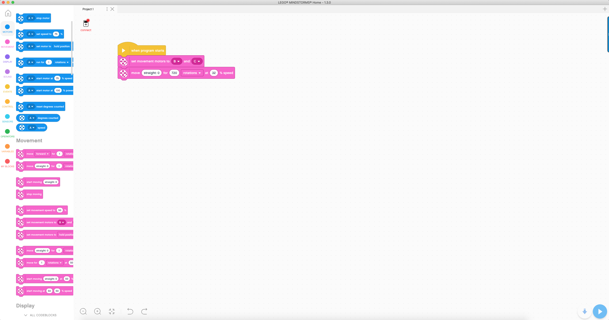
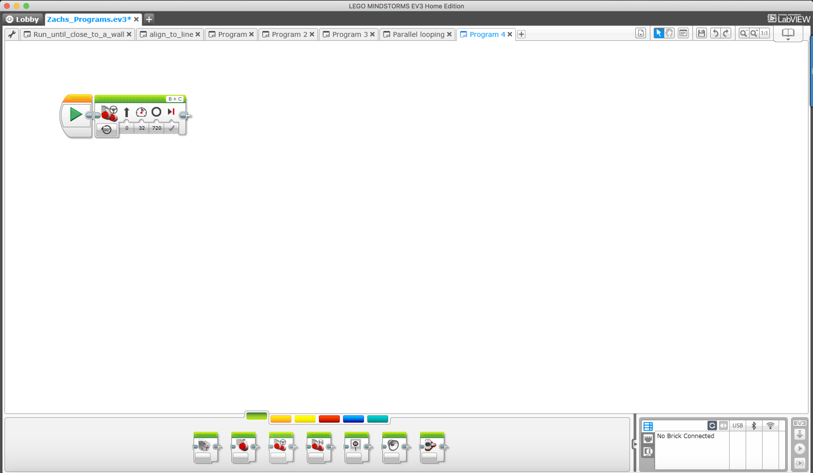

#Forward and Backward

---

We have talked about displaying things on the EV3 screen, making strings, integers, booleans, variables, and sounds, and understanding what different errors mean. Now we are going to learn how to make our robot move forward and backward. Moving your robot in micropython is a little different than labview and scratch because (1) you have to initialize your motors and (2) you have to write 2 lines to cover the movement of both motors. This is different from labview and scratch because they have just one block that does this, also both of them know already what the motors are and where they are.

Now, let's start by creating a project called _Forward and Backwards_ and open the main file. Let's start by initializing the motors, to do that type this in:

```python
#!/usr/bin/env pybricks-micropython

from pybricks import ev3brick as brick
from pybricks.ev3devices import (Motor, TouchSensor, ColorSensor,
                               InfraredSensor, UltrasonicSensor, GyroSensor)
from pybricks.parameters import (Port, Stop, Direction, Button, Color,
                               SoundFile, ImageFile, Align)
from pybricks.tools import print, wait, StopWatch
from pybricks.robotics import DriveBase

motor_b = Motor(Port.B)
motor_c = Motor(Port.C)
```

The first initialization shows that _motor_b_ is the motor that is on port B (later you will learn that the Motor is a class), be careful here because you can easily confuse the capitalization of Port.B and motor_b. The same thing is going on the second initialization because it's saying that motor_c is that motor that is on port C. Now that we have initialized the motors lets start moving the motors. Moving the motors requires 4 inputs called _parameters_ The parameters are the speed, distance, either brake or coast, and if we are going to run the block after while we are running this or are we going to only run this one and stop. Before we put in the parameters we will put the function that we will be using to move forward, as well as the motor that we will be moving forward. In the end it will look like this:

```python
motor_b.run_angle(500, 720, Stop.BRAKE, False)
motor_c.run_angle(500, 720, Stop.BRAKE, True)
```

We are first running motor_b, and the function that moves us forward is run_angle, the it takes 4 parameters 500 which is the speed, 720 which is the distance, Stop.BRAKE which is if we are coasting or braking, then we have false which means as we are running this, we need to run the blocks after. The next block is the same thing except we are moving motor_c and we do not want to run the lines after this line at the same time this line is executing. Now that we have done this, we have to now move backward. This is literally the same thing as moving forward except our distance is negative. It looks like this:

```python
motor_b.run_angle(500, -720, Stop.BRAKE, False)
motor_c.run_angle(500, -720, Stop.BRAKE, True)
```

When we add this to our code it ends like this:

```python
#!/usr/bin/env pybricks-micropython

from pybricks import ev3brick as brick
from pybricks.ev3devices import (Motor, TouchSensor, ColorSensor,
                               InfraredSensor, UltrasonicSensor, GyroSensor)
from pybricks.parameters import (Port, Stop, Direction, Button, Color,
                               SoundFile, ImageFile, Align)
from pybricks.tools import print, wait, StopWatch
from pybricks.robotics import DriveBase

motor_b = Motor(Port.B)
motor_c = Motor(Port.C)
motor_b.run_angle(500, 720, Stop.BRAKE, False)
motor_c.run_angle(500, 720, Stop.BRAKE, True)
motor_b.run_angle(500, -720, Stop.BRAKE, False)
motor_c.run_angle(500, -720, Stop.BRAKE, True)
```

**Note: all of the properties we have learned here works with the medium motors**

## What would this look like in LabView or Scratch?

In Scratch moving forward and backward would look like this:

In LabView moving forward and backward would look like this:

