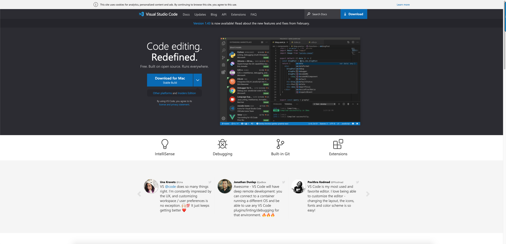
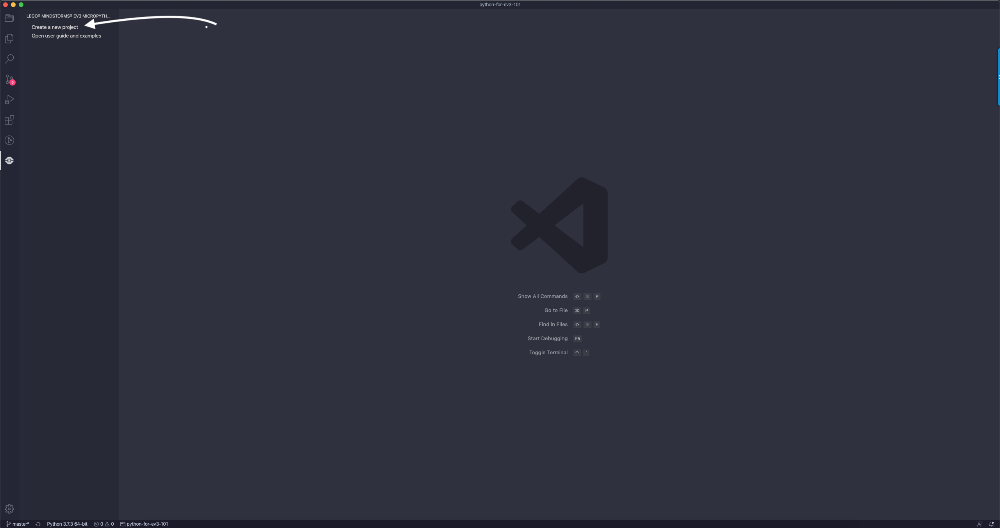

# Getting Setup

## Getting your Micro Sd card Setup

__Materials you will need:__

- A Windows 10 or Mac OS computer
- Internet access and administrator access(you will only need this for installation though)

- You will need a MicroSD card that is at least 4GB and up to 32GB also it's also reccomended to have a Application Performance that is Class A1.

- A microSD card reader in your computer

- A mini-USB cable, like the one included with your EV3 set(It doesn't work with Bluetooth so you will have to use USB)

Now that you have you materials lets get started.

**Step One: Get Visual  Studio Code**
Download Visual Studio Code or go to https://code.visualstudio.com/ when you open the webite you should see something like this:

Click "Download" and then select whichever os you are on. Once you have downloaded it follow the steps and you will have the app. 

**Step Two: Get the MicroPython Extention**
Visual Studio Code has a Extention called "LEGO® MINDSTORMS® EV3 MicroPython" To get this go to the Extentions tab on the far left it will look like this
 
click this and search up LEGO® MINDSTORMS® EV3 MicroPython and once you install that you are ready to use micropython. There will be a tab on the left most column that has the ev3 symbol. Once you click the symbol then it will look like this:

click 

