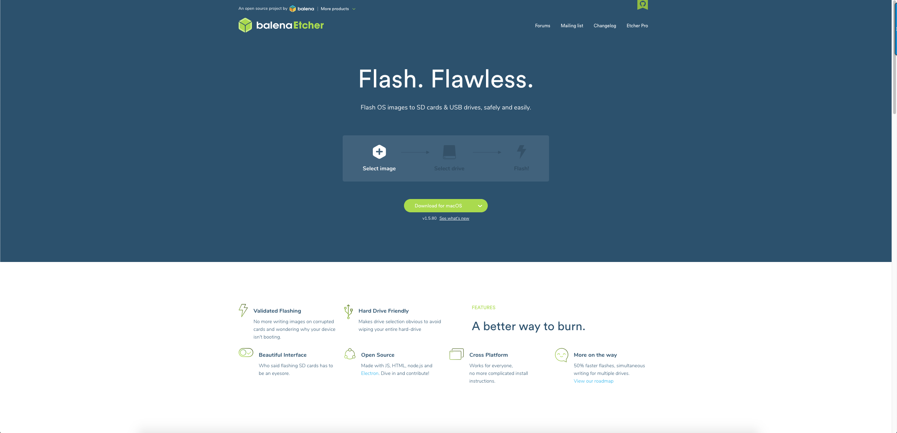
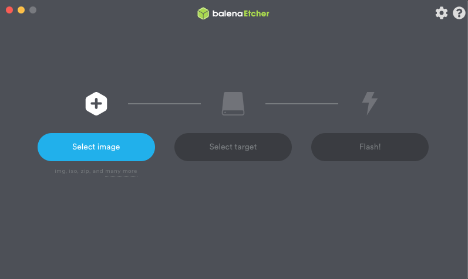
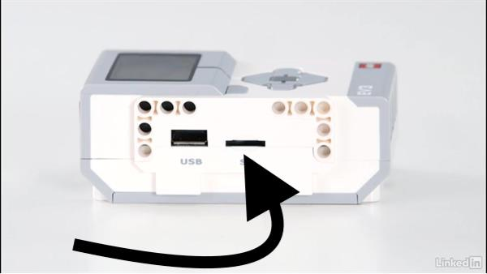

# Getting Setup

## Getting your Micro Sd card Setup

__Materials you will need:__

- A Windows 10 or Mac OS computer
- Internet access and administrator access(you will only need this for installation though)

- You will need a MicroSD card that is at least 4GB and up to 32GB also it's also recommended to have a Application Performance that is Class A1.

- A microSD card reader in your computer

- A mini-USB cable, like the one included with your EV3 set(It doesn't work with Bluetooth so you will have to use USB)

Now that you have your materials let's get started.

****
**Step One: Get Visual  Studio Code**
To download Visual Studio Code go to https://code.visualstudio.com/ when you open the website you should see something like this:

Click "Download" and then select whichever os you are on. Once you have downloaded it follow the steps and you will have the app. 

****
**Step Two: Get the MicroPython Extension**
Visual Studio Code has an Extension called "LEGO® MINDSTORMS® EV3 MicroPython" To get this go to the Extensions tab on the far left it will look like this:

 

Click this and search up LEGO® MINDSTORMS® EV3 MicroPython this extension was made by LEGO for the use of Micropython. There will be a tab on the left most column that has the EV3 symbol. Once you click the symbol then it will look like this:

Click "Create a new project" and then enter any name that you want.

****
**Step Three: Installing Balena Etcher**

Before you start programming you need to get your MicroSD card ready. This means you have Micropython installed on it. But to accomplish this you need Etcher which is a flashing tool for installing things on MicroSD Cards.
To install Balena Etcher go to <https://www.balena.io/etcher/> and it will look like this:

In the center it should say "Download for" and then whichever os you are on. After you have pressed this it will download Etcher but you will have to follow a series of steps.

****
**Step Four: Flash the MicroSD card**
click this [to download the image for your MicroSD Card](https://le-www-live-s.legocdn.com/sc/media/files/ev3-micropython/ev3micropythonv100sdcardimage-4b8c8333736fafa1977ee7accbd3338f.zip) once you have it then go back to Etcher and it should look like this:

Where it says "image" click and select the file you downloaded and it should let you continue. Once you have finished that, put your MicroSD card into your computer. After that click "Target" and you should be able to select that MicroSD card you just put in the computer. Lastly click "Flash!" and it will Flash your MicroSD card with Micropython.
****
**Step Five: Start it up!**
Go to your EV3 Brick and put the sd card in the SD Port as shown:

Once you place it in there then you turn on the brick and after a few minutes  Micropython will open up. Then use the EV3 Wire and use it to connect your EV3 to your computer.

Go to Visual Studio Code and at the left most side there will be a tab called the explorer tab. When you go there then at the bottom there will be a dropdown called the "EV3DEV Device Browser." Under that there it will say "Click here to connect to a device" Click this and it will ask you which robot you want to pick, although there will be one robot there and a button that says,"I don't see my device..." Click your EV3 and under the device browser it will show you device and there will be a color under it waiting for it to turn green signalling that your robot is connected.

**Hurray YOU have set up your EV3 for Micropython!**

[Click This to Go to the First Chapter: Hello, World](First_Program.md)
