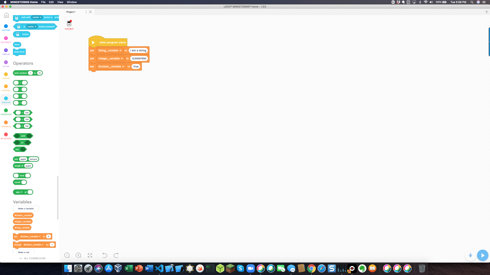
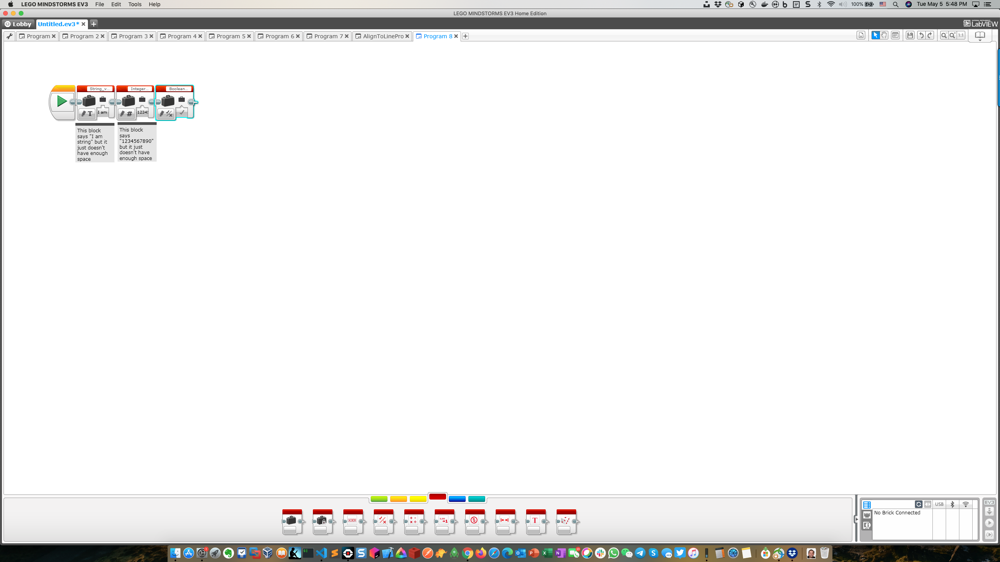

## Variables, Strings, Integers and Booleans

---

## What's a String?

The simple way to explain a string is anything that you can type, though it also includes emoji's and things like that. The way python knows that something is a string is when you put it within quotes, it doesn't matter whether they're single or double as long as you use the same from the beginning as the end.

This is a string that works:

```python
"Hi! 😊"
```

This isn't:

```
"Hi'
```

Can you guess what's the problem with the second one? It's because you used double-quotes in the beginning and single-quotes at the end. This confuses python, and then it will consider everything after it a string.

An example you can use to test and play with strings is use the print statement. Go into your main file and type this in.

```python
print("This is a print statement")
```

Print statements are useful because while your robot is moving you can have the print statement give inputs to your computer. Another thing that you can do with strings is concatenation. Basically it combines two different strings. Type this into your computer:

```python
print("Hello" + " Bob")
```

This code adds these 2 strings together to set "Hi Bob" You can use this a lot when a string doesn't have to be the same thing. Print statements don't only work with strings though.

---

## What is an Integer?

An integer is pretty straightforward; it's any number that isn't a fraction or decimal. Let's use this inside a print statement:

```python
print(5)
```

This code will(surprisingly enough) print the number 5. Print statements with integers can also do arithmetic with it.
You can add:

```python
print(5+3)
```

You can divide:

```python
print(6/3)
```

You can multiply:

```python
print(5*3)
```

And much more. it follows the order of operations and every operation that is in it. But there is one more thing that is added to the arithmetic, modulo which is expressed with %. This is the remainder when 2 things are divided. An example of this is when you calculate 5%3. You will get 2 because it's 1 remainder 2, but this only cares about the remainder, so it will print out 2. Okay we have learned all about strings and integers but there is one more. I am not going to talk too much about this because there isn't much to talk about. The last one is called **booleans** and basically there just _True_ and _False_ you just need to remember that the first letter in both words are capitals.

## What's a variable?

A variable is something that stores data which you can access by its name. Variables can be assigned to strings, integers, and booleans. They look like this:

```python
String_variable = 'I am a string'
Integer_variable = 1234567890
Boolean_variable= True
```

These are some different types of variables. What is their point though? There point is that later when you are making ginormous programs and you will want to keep some variables at the top with some values that are important and you will use a lot so that when you change those then you can easily make 10 changes at once, and I am pretty confident that you would rather do one change then do 10 changes in its place.
To reference a variable then you just have to use the name that you assigned it with. Such as the previous one if you are going to print those then you would do:

```python
print(String_variable)
print(Integer_variable)
print(Boolean_variable)
```

These are some examples of referencing the variables. But you can use them in many different things. When we are doing the hello world program then you could instead make a variable of what you would want to display. This would look like this:

```python
from pybricks import ev3brick as brick
from pybricks.ev3devices import (Motor, TouchSensor, ColorSensor,
                               InfraredSensor, UltrasonicSensor, GyroSensor)
from pybricks.parameters import (Port, Stop, Direction, Button, Color,
                               SoundFile, ImageFile, Align)
from pybricks.tools import print, wait, StopWatch
from pybricks.robotics import DriveBase

Words_to_display = 'Hello World'

brick.display.clear()

brick.display.text(Words_to_display)
```

This might seem a little peculiar because we just added a line of code instead of shortened it. Yeah, but sometimes it matters more of how easy it is to understand rather than what is faster to type, and it will make it easy for you later because maybe youre gone one time and someone else is coding then it will be easier for them to understand and they will faster be able to add code. Also maybe you are starting again on your code after a pretty long time. You are bound to lose your bearings of what you are doing. So it will be a bunch easier to start again.

##What would this look like in LabView or Scratch?

**Note:** I will show making variables in Scratch and Labview since there wasn't just one program in this chapter.

In Scratch making a variable would look like this:


In LabView making a variable would look like this:


[Click This to Go to the Third Chapter: The Dog Goes,"Bark"](Second_Program.md)
